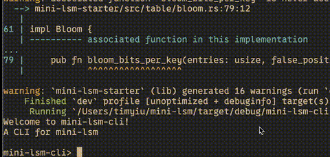

# An LSM-tree storage engine in Rust

> [!IMPORTANT]
> The code here is offered as a learning aid to help you build intuition and see one possible way of solving the problem. Readers are strongly encouraged to engage actively with the material and develop their own independent implementations. Trust your curiosity, embrace the bugs along the way, and enjoy the journey of crafting your own unique solutions!

* My implementation is available [here](mini-lsm-starter).
* Read the [book](https://skyzh.github.io/mini-lsm) for the details.
